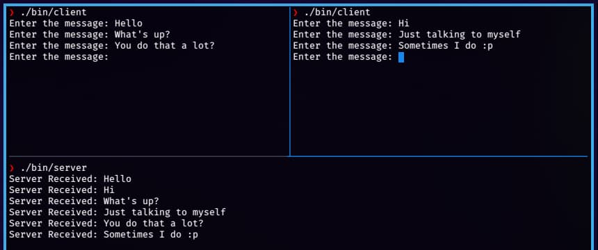

<div align = "center">

<h1><a href="https://2kabhishek.github.io/csock">csock</a></h1>

<a href="https://github.com/2KAbhishek/csock/blob/main/LICENSE">
 </a>

<a href="https://github.com/2KAbhishek/csock/graphs/contributors">
 </a>

<a href="https://github.com/2KAbhishek/csock/stargazers">
</a>

<a href="https://github.com/2KAbhishek/csock/network/members">
 </a>

<a href="https://github.com/2KAbhishek/csock/watchers">
 </a>

<a href="https://github.com/2KAbhishek/csock/pulse">
 </a>

<h3>Socket chat using C 🔌🗯️</h3>

<figure>
  
  <br/>
  <figcaption>csock screenshot</figcaption>
</figure>

</div>

## What is this

csock is a multi client chat application built with C.

## Inspiration

Had an idea to implement this while learning about sockets.

## Prerequisites

Before you begin, ensure you have met the following requirements:

- You have installed the latest version of `gcc`

## Getting csock

To get csock, follow these steps:

```bash
git clone https://github.com/2kabhishek/csock
cd csock
```

## Using csock

- To run server

```bash
make run-server
```

- To run clients

```bash
make run-client
```

## How it was built

csock was built using `neovim and gcc`

## What I learned

- Learned about sockets and implementation in C

Hit the ⭐ button if you found this useful.

## More Info

For Java implementation see [socket-chat](https://github.com/2KAbhishek/socket-chat/)

<div align="center">

<a href="https://github.com/2KAbhishek/csock">Source</a> | <a href="https://2kabhishek.github.io/csock">Website</a>

</div>
